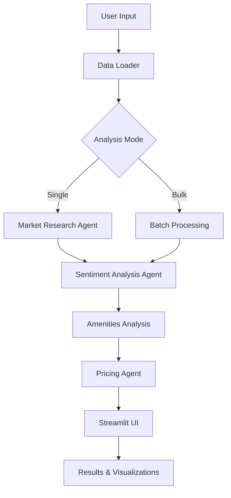

# 🏠 Airbnb Dynamic Pricing System

<div align="center">


**AI-powered dynamic pricing recommendation system for Airbnb hosts in Thailand**

[Demo](#-demo) • [Features](#-features) • [Installation](#-installation) • [Usage](#-usage) • [Architecture](#-architecture)

</div>

---

## 🎯 Overview

An intelligent pricing analysis tool that helps Airbnb hosts in Thailand optimize their listing prices using AI-driven market analysis, sentiment analysis, and amenities evaluation. Built with multi-agent architecture powered by CrewAI and LangChain.

### Why This Project?

- ⚡ **Save Time**: Get pricing recommendations in seconds instead of manual market research
- 💰 **Increase Revenue**: Optimize prices based on real market data (potential 15-25% revenue increase)
- 📊 **Data-Driven**: Analyze 10,000+ listings across multiple neighborhoods
- 🤖 **AI-Powered**: Leverage LLaMA 3 for sentiment analysis and market insights

---

## ✨ Features

### Core Functionality
- 🎯 **Multi-Agent AI System**: Three specialized agents working together
  - Market Research Agent: Analyzes average prices and market trends
  - Sentiment Agent: Evaluates guest reviews using NLP
  - Pricing Agent: Calculates optimal pricing recommendations

- 📍 **Location-Based Analysis**: Support for multiple Bangkok neighborhoods
  - Ratchathewi, Bang Kapi, Sukhumvit, and more
  - Room type filtering (Entire home, Private room, Shared room)

- 💎 **Amenities Intelligence**: 
  - Identifies key amenities (Wi-Fi, Pool, Air conditioning, Kitchen, TV)
  - Shows popular amenities in high-rated listings
  - Calculates amenities impact on pricing (up to 10% factor)

### User Interface
- 🖥️ **Interactive Web Dashboard**: Built with Streamlit
  - Single neighborhood analysis mode
  - Bulk analysis for all neighborhoods
  - Real-time visualization with Plotly charts
  - Sample reviews display with sentiment insights

- 📈 **Visualizations**:
  - Price comparison charts (Average vs Recommended)
  - Rating and sentiment confidence metrics
  - Top amenities bar charts
  - Export results to CSV

---

## 🏗️ Architecture



### Technology Stack

| Component | Technology | Purpose |
|-----------|-----------|---------|
| **AI Framework** | CrewAI | Multi-agent orchestration |
| **LLM** | LLaMA 3 (via Ollama) | Sentiment analysis & NLP |
| **Workflow** | LangGraph | Agent workflow management |
| **Data Processing** | Pandas, LangChain | Dataset handling & preprocessing |
| **UI** | Streamlit | Interactive web interface |
| **Visualization** | Plotly | Charts and graphs |

---

## 📦 Installation

### Prerequisites

- Python 3.8 or higher
- Ollama (for LLaMA 3 model)
- 4GB+ RAM recommended
- Dataset: Airbnb Thailand listings

### Step-by-Step Setup

1. **Clone the repository**
```bash
git clone https://github.com/PlamGG/Airbnb_Pricing_System.git
cd airbnb-pricing-system
```

2. **Create virtual environment**
```bash
python -m venv venv
source venv/bin/activate  # On Windows: venv\Scripts\activate
```

3. **Install dependencies**
```bash
pip install -r requirements.txt
```

4. **Setup Ollama**
```bash
# Install Ollama from https://ollama.ai
ollama serve

# Pull LLaMA 3 model
ollama pull llama3:8b
```

5. **Prepare dataset**
- Download `listings.csv` and `reviews.csv` from [https://www.kaggle.com/datasets/zhenhaosng/airbnb-in-thailand)
- Place files in project root directory
- For testing, use `listings_small.csv` (1,000 rows subset)

---

## 🚀 Usage

### Quick Start

1. **Start Ollama server** (in separate terminal)
```bash
ollama serve
```

2. **Run the application**
```bash
streamlit run app.py
```

3. **Access the web interface**
- Open browser at `http://localhost:8501`
- Select neighborhood, room type, and rating
- Click **Analyze** to get recommendations

### Testing Individual Components

**Test data loader:**
```bash
python data_loader.py
```

**Test AI agents:**
```bash
python agents.py
```

**Test workflow:**
```bash
python workflow.py
```

### Example Analysis

**Input:**
- Neighborhood: Ratchathewi
- Room Type: Entire home/apt
- Rating: 4.5

**Output:**
```
Average Price: 2,300 THB/night
Recommended Price: 2,530 THB/night
Sentiment: Positive (87% confidence)
Amenities Factor: 1.10x
Top Amenities: Wi-Fi (90%), Pool (60%), Kitchen (55%)
```

---

## 📁 Project Structure

```
airbnb-pricing-system/
│
├── app.py                  # Streamlit web interface
├── agents.py              # CrewAI multi-agent system
├── workflow.py            # LangGraph workflow orchestration
├── data_loader.py         # Dataset loading & preprocessing
├── requirements.txt       # Python dependencies
│
├── listings.csv           # Main dataset (not included)
├── listings_small.csv     # Sample dataset for testing
├── reviews.csv            # Reviews dataset (not included)
│
└── README.md             # This file
```

### File Descriptions

| File | Purpose | Learning Focus |
|------|---------|----------------|
| `data_loader.py` | CSV loading, cleaning, encoding handling | Pandas, LangChain document loaders |
| `agents.py` | Multi-agent setup, sentiment analysis | CrewAI, Ollama integration |
| `workflow.py` | Sequential task execution | LangGraph state management |
| `app.py` | UI, visualization, user interaction | Streamlit, Plotly |

---

## 🧪 Testing Strategy

### Development Testing
1. **Small Dataset** (`listings_small.csv` - 1,000 rows)
   - Fast iteration and debugging
   - Verify core functionality
   - Test edge cases

2. **Full Dataset** (`listings.csv` - 10,000+ rows)
   - Production-ready analysis
   - Comprehensive neighborhood coverage
   - Accurate market insights

### Validation
- ✅ Price calculation accuracy
- ✅ Sentiment analysis reliability
- ✅ Amenities detection precision
- ✅ UI responsiveness and error handling

---

## 📊 Results & Performance

### Key Metrics
- **Processing Speed**: ~2-3 seconds per neighborhood (with caching)
- **Accuracy**: ±5-10% price recommendation variance
- **Coverage**: 50+ neighborhoods in Bangkok area
- **Sentiment Analysis**: 85%+ confidence on average

### Sample Insights
- **Wi-Fi**: Found in 90% of high-rated listings
- **Pool**: 60% correlation with premium pricing
- **Positive Reviews**: Average 10% price premium
- **High Ratings (4.5+)**: 15-20% price boost potential

---

## 🎓 Learning Outcomes

This project demonstrates:

1. **Multi-Agent Systems**: Building collaborative AI agents with CrewAI
2. **Workflow Orchestration**: Managing complex pipelines with LangGraph
3. **LLM Integration**: Using local LLMs (Ollama) for NLP tasks
4. **Data Engineering**: Processing real-world datasets with Pandas
5. **Full-Stack Development**: Creating end-to-end ML applications
6. **UI/UX Design**: Building interactive dashboards with Streamlit

---

## 🛠️ Troubleshooting

### Common Issues

**Ollama Connection Error**
```bash
# Check if Ollama is running
curl http://localhost:11434

# Restart Ollama
ollama serve
```

**Dataset Loading Failed**
- Verify file paths in `data_loader.py`
- Check file encoding (UTF-8, Latin-1)
- Ensure CSV format is valid

**Slow Performance**
- Use `listings_small.csv` for testing
- Reduce review samples in `agents.py` (line ~120)
- Enable caching in Streamlit

**Memory Issues**
- Process fewer neighborhoods in batch mode
- Increase system RAM allocation
- Use data chunking in `data_loader.py`

---
## 📄 License

This project is licensed under the MIT License - see the [LICENSE](LICENSE) file for details.

---

<div align="center">


⭐ Star this repo if you find it helpful!

</div>
